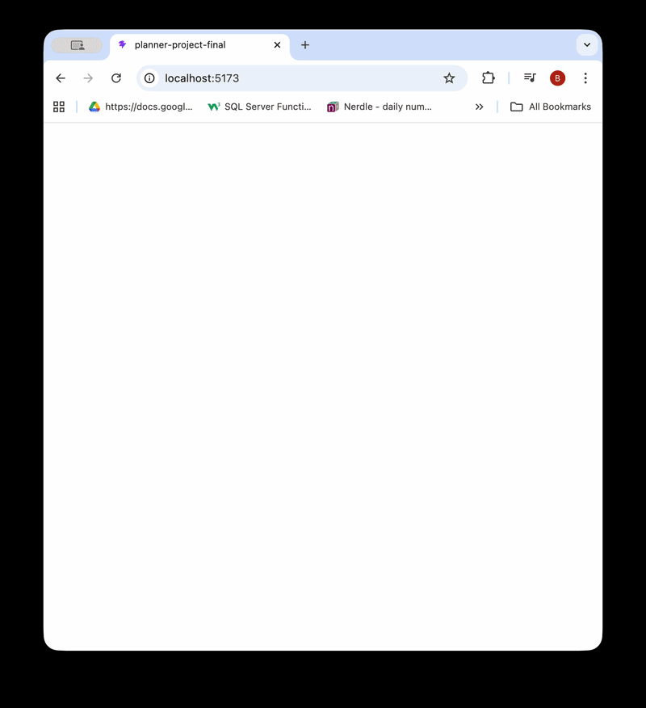

# Weekly Planner 
*scroll to the bottom to see what it looks like so far!*
<br/>
<br/>
This is my first project using web-development skills I've taught myself as well as GitHub! I will build on this ReadMe as my project develops and my learning grows. For now, I have only focused on the front-end to learn **React**, and once the UI looks as I want it to and the front-end is fully functional, I will endeavour to learn **Node.js** for a fully-functioning organisation app. Stay tuned! 
<br/>
For now, just the basics...
<br/>
## Technologies
- React
- Vite

## Features
- Simple, pleasing colour scheme with dynamic buttons and page transitions
- Sign-up page records user's habits and events they want to upkeep and attend respectively.
- *Coming soon... planner page! once user has signed-up/logged in, the planner will load with the following features:*

  - to-do list and habit "score" dial - showing % of tasks/habits done.
  - checklist of today's habits
  - day "cards" displaying upcoming events or to-do lists for the specified day
  - a word of the day! 
  - news reel?

## Running the Project
- Clone the repository
- Install dependencies: ```npm install```
  - vite
  - framer-motion
  - react
  - react-router-dom
- Run development server: ```npm run dev```
- Open localhost in your browser

## Preview
What it looks like now...
<br/>



